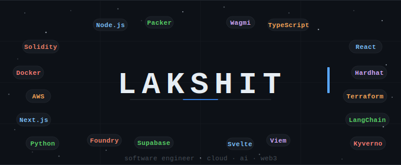

  

 

&nbsp;

&nbsp;

&nbsp;

---

  

---

<table width="100%" border="0" cellspacing="0" cellpadding="10">
<tr>
<td align="center" width="20%">
  
<code>AWS · Docker · K8s</code> 
<code>Kyverno · Terraform</code> 
<code>Packer · Linux</code>
</td>
<td align="center" width="20%">
  
<code>Python · LangChain</code> 
<code>OpenAI · HuggingFace</code> 
<code>Ollama · Pandas</code>
</td>
<td align="center" width="20%">
  
<code>Solidity · Hardhat</code> 
<code>Foundry · Wagmi</code> 
<code>Viem · Ethereum</code>
</td>
<td align="center" width="20%">
  
<code>React · Next.js</code> 
<code>Svelte · Node.js</code> 
<code>TypeScript · Tailwind</code>
</td>
<td align="center" width="20%">
  
<code>React Native</code> 
<code>Flutter</code> 
<code>(learning)</code>
</td>
</tr>
</table>

---

 
